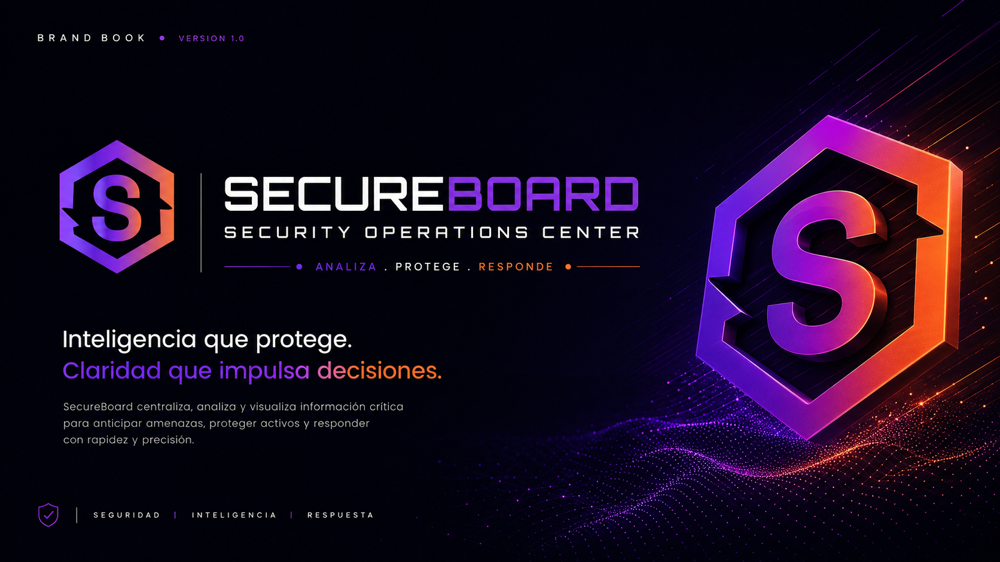
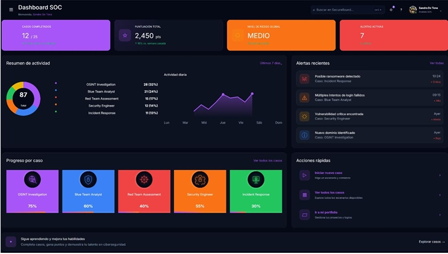
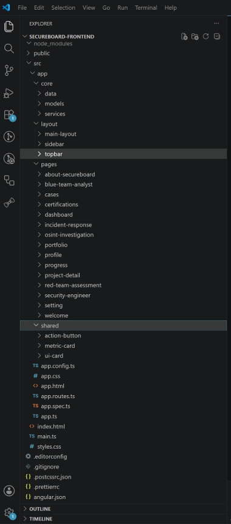
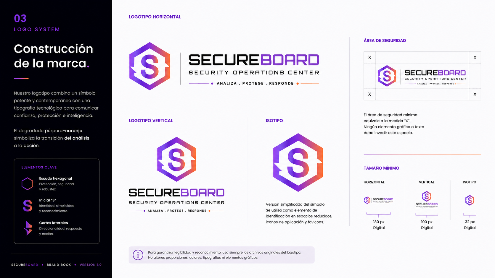
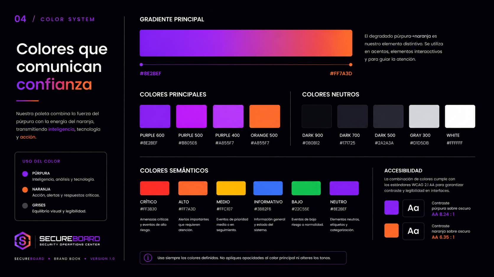
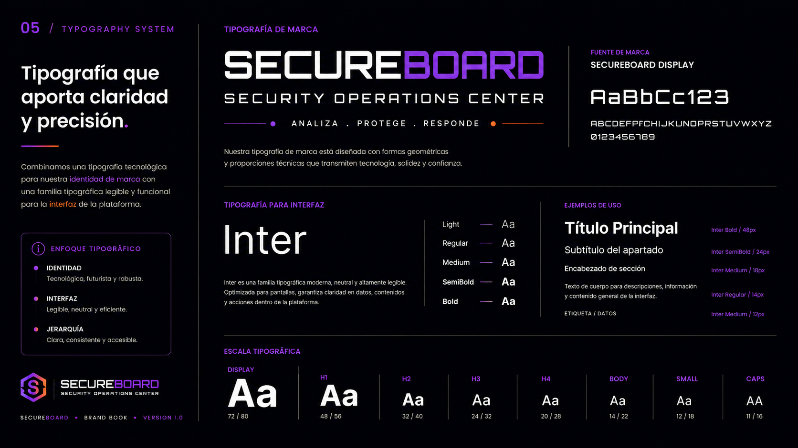

<div align="center">

# 🛡️ SECUREBOARD

### Security Operations Center · Frontend

**ANALIZA · PROTEGE · RESPONDE**

Frontend de una plataforma SOC orientada a la visualización, análisis y gestión de información de ciberseguridad, desarrollada con **Angular, TypeScript, RxJS y Tailwind CSS**.

<br>



<br>


<br>


</div>

---

## 📌 Sobre SecureBoard

**SecureBoard** es un proyecto personal de desarrollo web y ciberseguridad inspirado en el funcionamiento y las necesidades visuales de un **Security Operations Center (SOC)**.

El objetivo es construir una plataforma capaz de transformar información relacionada con seguridad en una experiencia visual clara, estructurada y orientada a la toma de decisiones.

SecureBoard combina tres áreas principales:

**💻 Desarrollo Frontend** · **🎨 UI/UX** · **🛡️ Ciberseguridad**

La aplicación plantea diferentes áreas relacionadas con:

- 📊 Monitorización y visualización de información.
- 🔎 Investigación OSINT.
- 🛡️ Análisis de vulnerabilidades.
- 🚨 Gestión de incidentes y alertas.
- 🔴 Red Team.
- 🔵 Blue Team.
- 👩‍💻 Formación mediante casos de ciberseguridad.
- 📈 Seguimiento del progreso.
- 👤 Gestión del perfil del usuario.

> [!IMPORTANT]
> Este repositorio contiene **exclusivamente el frontend de SecureBoard**.
>
> El backend basado en **Java, Spring Boot y MySQL** se desarrolla de manera independiente y actualmente continúa en desarrollo.

---

# 🎯 Objetivo del proyecto

SecureBoard nace con el objetivo de reunir diferentes áreas de mi perfil profesional dentro de un único proyecto completo.

### 💻 Frontend Development

Construcción de una aplicación web moderna mediante Angular y TypeScript, trabajando arquitectura, navegación, componentes reutilizables, modelos, servicios y diseño responsive.

### 🎨 UI/UX & Diseño

Creación desde cero de la identidad visual de SecureBoard, su sistema de diseño y una interfaz orientada a presentar grandes cantidades de información de forma clara.

### 🛡️ Ciberseguridad

Aplicación de conocimientos adquiridos en ciberseguridad mediante casos y áreas inspiradas en actividades de un SOC, Blue Team, Red Team, OSINT e Incident Response.

---

# 🖥️ SecureBoard Frontend

## 📊 Dashboard SOC

El Dashboard funciona como centro de control de SecureBoard.

Permite acceder rápidamente a información relacionada con actividad, riesgo, alertas y evolución dentro de la plataforma.



La interfaz incluye elementos como:

- Casos completados.
- Puntuación total.
- Nivel de riesgo global.
- Alertas activas.
- Resumen de actividad.
- Gráficos de evolución.
- Alertas recientes.
- Progreso por caso.
- Acciones rápidas.

El objetivo es aplicar un principio fundamental de SecureBoard:

> **Convertir información compleja en información clara, visual y accionable.**

---

# 🧩 Áreas de la aplicación

SecureBoard está dividido en diferentes experiencias y módulos relacionados con ciberseguridad.

### 🏠 Dashboard

Vista general del estado y actividad dentro de la plataforma.

### 🌐 OSINT Investigation

Área orientada a investigación mediante fuentes abiertas, búsqueda y análisis de información.

### 🔵 Blue Team Analyst

Casos relacionados con defensa, monitorización, detección y análisis de amenazas.

### 🔴 Red Team Assessment

Experiencias orientadas al análisis ofensivo y comprensión de vulnerabilidades.

### 🛡️ Security Engineer

Contenido relacionado con protección, configuración, hardening y seguridad de sistemas.

### 🚨 Incident Response

Casos orientados a la identificación, análisis y respuesta ante incidentes.

### 📁 Cases

Consulta y gestión de los diferentes casos disponibles dentro de SecureBoard.

### 📈 Progress

Seguimiento visual del progreso y evolución.

### 🏆 Certifications

Área destinada a representar certificaciones y aprendizaje.

### 👤 Profile

Información y configuración del perfil.

### ⚙️ Settings

Configuración de la experiencia dentro de la aplicación.

---

# 🏗️ Arquitectura Frontend

La arquitectura de SecureBoard busca separar responsabilidades y mantener el proyecto preparado para crecer.



```text
src/
└── app/
    │
    ├── core/
    │   ├── data/
    │   ├── models/
    │   └── services/
    │
    ├── layout/
    │   ├── main-layout/
    │   ├── sidebar/
    │   └── topbar/
    │
    ├── pages/
    │   ├── about-secureboard/
    │   ├── blue-team-analyst/
    │   ├── cases/
    │   ├── certifications/
    │   ├── dashboard/
    │   ├── incident-response/
    │   ├── osint-investigation/
    │   ├── portfolio/
    │   ├── profile/
    │   ├── progress/
    │   ├── project-detail/
    │   ├── red-team-assessment/
    │   ├── security-engineer/
    │   ├── settings/
    │   └── welcome/
    │
    ├── shared/
    │   ├── action-button/
    │   ├── metric-card/
    │   └── ui-card/
    │
    ├── app.config.ts
    ├── app.routes.ts
    ├── app.ts
    ├── app.html
    └── app.css
```

### `core/`

Contiene elementos centrales de la aplicación:

- Datos.
- Modelos.
- Servicios.

### `layout/`

Gestiona la estructura visual principal:

- Main Layout.
- Sidebar.
- Topbar.

### `pages/`

Contiene las diferentes vistas y funcionalidades de SecureBoard.

### `shared/`

Agrupa componentes reutilizables utilizados en diferentes áreas de la aplicación.

---

# 🧱 Componentes reutilizables

Una de las decisiones de arquitectura ha sido evitar repetir estructuras visuales y comportamientos comunes.

Por ello existen componentes compartidos como:

```text
shared/
├── action-button/
├── metric-card/
└── ui-card/
```

Esto permite conseguir:

- ♻️ Reutilización de código.
- 🎨 Consistencia visual.
- 🧹 Mayor mantenibilidad.
- 📦 Componentes desacoplados.
- 🚀 Mayor facilidad para ampliar la aplicación.

---

# 🛠️ Stack tecnológico

<div align="center">


</div>

| Tecnología | Aplicación |
|---|---|
| **Angular** | Framework principal del frontend |
| **TypeScript** | Lógica de aplicación y tipado |
| **RxJS** | Programación reactiva y gestión de flujos |
| **HTML5** | Estructura semántica |
| **CSS3** | Estilos y personalización |
| **Tailwind CSS** | Construcción y composición de interfaces |

---

# 🔧 Herramientas de desarrollo

<div align="center">


</div>

| Herramienta | Uso |
|---|---|
| **Visual Studio Code** | Desarrollo del proyecto |
| **Git** | Control de versiones |
| **GitHub** | Repositorio, ramas y Pull Requests |
| **Figma** | Diseño UI/UX y sistema visual |

---

# 🎨 UI/UX & Brand Identity

SecureBoard no comienza únicamente en el código.

Una parte importante del proyecto ha sido diseñar una **identidad visual completa** y trasladarla posteriormente a la interfaz desarrollada en Angular.

La marca se construye alrededor de tres conceptos:

<div align="center">

### ANALIZA · PROTEGE · RESPONDE

</div>

El sistema visual combina una estética oscura vinculada a entornos tecnológicos y de ciberseguridad con un degradado púrpura-naranja.

---

# 🔷 Sistema de logotipo

La identidad de SecureBoard utiliza un símbolo geométrico inspirado en:

- Protección.
- Seguridad.
- Tecnología.
- Inteligencia.
- Monitorización.
- Respuesta.



El isotipo integra la inicial **S** dentro de una estructura hexagonal que actúa como símbolo identificativo del producto.

---

# 🎨 Sistema de color



El degradado principal representa conceptualmente el flujo:

### 🟣 ANÁLISIS → 🟠 ACCIÓN

**Púrpura**

Asociado a inteligencia, análisis y tecnología.

**Naranja**

Asociado a acción, alertas y respuesta.

Además, el Design System incorpora colores semánticos:

| Estado | Significado |
|---|---|
| 🔴 **Crítico** | Amenaza o evento crítico |
| 🟠 **Alto** | Riesgo elevado |
| 🟡 **Medio** | Prioridad intermedia |
| 🔵 **Informativo** | Información del sistema |
| 🟢 **Bajo** | Riesgo reducido |
| 🟣 **Neutro** | Elementos generales |

---

# 🔤 Sistema tipográfico



El sistema tipográfico diferencia entre la identidad visual de marca y la tipografía funcional utilizada dentro de la aplicación.

En la interfaz se priorizan:

- Legibilidad.
- Jerarquía visual.
- Claridad.
- Consistencia.
- Lectura rápida de datos.

Estos criterios son especialmente importantes en aplicaciones basadas en dashboards y monitorización.

---

# 🧠 Principios UX

SecureBoard se ha diseñado teniendo en cuenta diferentes principios de experiencia de usuario.

### Claridad

La información importante debe poder identificarse rápidamente.

### Jerarquía

Los datos se organizan visualmente según su relevancia.

### Consistencia

Los componentes mantienen patrones visuales y de interacción comunes.

### Feedback

Estados, alertas y acciones proporcionan respuesta visual al usuario.

### Escaneabilidad

Los dashboards permiten localizar información sin necesidad de leer grandes cantidades de texto.

### Accesibilidad

Se tienen en cuenta contraste, legibilidad, estados y organización de contenidos.

---

# ♿ Accesibilidad

Durante el diseño y desarrollo se han tenido en cuenta aspectos relacionados con:

- Contraste entre texto y fondo.
- Jerarquía visual.
- Tamaño y legibilidad del texto.
- Estados diferenciados.
- Feedback visual.
- Organización de contenidos.
- Consistencia entre componentes.
- Diseño responsive.

El objetivo es conseguir una interfaz que no solo resulte visualmente atractiva, sino que facilite la comprensión de la información.

---

# 🔄 Flujo de trabajo

El desarrollo de SecureBoard sigue un proceso iterativo que conecta diseño y programación.

```text
IDEA
  ↓
INVESTIGACIÓN
  ↓
UX / ARQUITECTURA DE INFORMACIÓN
  ↓
DISEÑO UI
  ↓
DESIGN SYSTEM
  ↓
PROTOTIPADO
  ↓
DESARROLLO ANGULAR
  ↓
COMPONENTIZACIÓN
  ↓
PRUEBAS
  ↓
REFACTORIZACIÓN
  ↓
MEJORA CONTINUA
```

De esta forma, las decisiones visuales tienen una correspondencia directa con la implementación técnica.

---

# 🧠 Decisiones técnicas

## 📦 Arquitectura organizada

El proyecto diferencia claramente páginas, layouts, servicios, modelos y componentes reutilizables.

## ♻️ Componentización

Los elementos utilizados repetidamente se convierten en componentes compartidos para reducir duplicación.

## 🧭 Routing

Las diferentes áreas de SecureBoard se organizan mediante el sistema de rutas de Angular.

## 🔷 TypeScript

El tipado ayuda a mantener estructuras de datos claras y facilita el mantenimiento del código.

## ⚡ RxJS

RxJS permite trabajar con programación reactiva y gestionar flujos de datos dentro de la aplicación.

## 📱 Responsive Design

La interfaz está planteada para adaptarse a diferentes tamaños y resoluciones.

## 🎨 Design System

Colores, estados, componentes, tipografía y patrones de interacción siguen un sistema visual común.

## 🔀 Git Flow

El desarrollo utiliza Git y GitHub mediante ramas, commits y Pull Requests para mantener una evolución controlada del proyecto.

---

# 🛡️ Ciberseguridad aplicada al proyecto

SecureBoard también funciona como proyecto práctico para trasladar conocimientos de ciberseguridad a una experiencia digital.

Entre las áreas estudiadas y representadas se encuentran:

```text
SOC & Monitoring
OSINT
Threat Intelligence
Vulnerability Analysis
Incident Response
Blue Team
Red Team
Security Engineering
Hardening
Basic Pentesting
```

---

# 🔐 Herramientas de ciberseguridad estudiadas

Durante mi formación y desarrollo del concepto SecureBoard he trabajado o estudiado herramientas como:

<div align="center">


</div>

```text
Kali Linux
Nmap
Nessus
Burp Suite
Wireshark
CyberChef
VirusTotal
TryHackMe
```

> [!NOTE]
> Estas herramientas forman parte del contexto de formación, investigación y aprendizaje asociado a SecureBoard.
>
> **No significa que todas ellas estén integradas técnicamente dentro de este frontend.**

---

# 🔌 Evolución Full Stack

SecureBoard está concebido para evolucionar desde el frontend actual hacia una arquitectura Full Stack.

La arquitectura prevista es:

```text
              SECUREBOARD

┌─────────────────────────────┐
│                             │
│           ANGULAR           │
│          FRONTEND           │
│                             │
└──────────────┬──────────────┘
               │
               │ REST API
               │
               ▼
┌─────────────────────────────┐
│                             │
│        SPRING BOOT          │
│           BACKEND           │
│                             │
└──────────────┬──────────────┘
               │
               │
               ▼
┌─────────────────────────────┐
│                             │
│            MYSQL            │
│          DATABASE           │
│                             │
└─────────────────────────────┘
```

El backend se está desarrollando independientemente utilizando:


> [!WARNING]
> Java, Spring Boot y MySQL **no forman parte del código de este repositorio**.
>
> Se muestran únicamente para documentar la evolución Full Stack prevista de SecureBoard.

---

# 🔐 Autenticación prevista

La integración Full Stack contempla autenticación basada en JWT.

```text
┌──────────────┐
│   Usuario    │
└──────┬───────┘
       │
       │ Credenciales
       ▼
┌──────────────┐
│   Angular    │
└──────┬───────┘
       │
       │ POST /auth/login
       ▼
┌──────────────┐
│ Spring Boot  │
└──────┬───────┘
       │
       │ Autenticación
       ▼
┌──────────────┐
│     JWT      │
└──────┬───────┘
       │
       │ Token
       ▼
┌──────────────┐
│   Angular    │
└──────┬───────┘
       │
       │ Bearer Token
       ▼
┌──────────────┐
│  Recursos    │
│  protegidos  │
└──────────────┘
```

Esta funcionalidad corresponde a la integración con el backend y **no se presenta como una característica finalizada de este repositorio frontend**.

---

# 🚀 Instalación y ejecución

## 1. Clonar el repositorio

```bash
git clone https://github.com/SandraDeTena/secureboard-frontend.git
```

## 2. Entrar en el proyecto

```bash
cd secureboard-frontend
```

## 3. Instalar dependencias

```bash
npm install
```

## 4. Ejecutar el proyecto

```bash
ng serve
```

También puede utilizarse:

```bash
npm start
```

## 5. Abrir en el navegador

```text
http://localhost:4200
```

---

# 📋 Requisitos

Para ejecutar el proyecto localmente se necesita:

- Node.js
- npm
- Angular CLI
- Git

Las versiones instaladas pueden comprobarse mediante:

```bash
node --version
npm --version
ng version
git --version
```

---

# 🗺️ Roadmap

## 🎨 Diseño

- [x] Concepto de SecureBoard.
- [x] Naming.
- [x] Identidad visual.
- [x] Sistema de logotipo.
- [x] Paleta de colores.
- [x] Sistema tipográfico.
- [x] Design System inicial.
- [x] Diseño de Dashboard.
- [x] Diseño de diferentes áreas de la plataforma.

## 💻 Frontend

- [x] Creación del proyecto Angular.
- [x] Arquitectura inicial.
- [x] Layout principal.
- [x] Sidebar.
- [x] Topbar.
- [x] Routing.
- [x] Dashboard.
- [x] Diferentes páginas de la plataforma.
- [x] Componentes reutilizables.
- [x] Diseño responsive inicial.

## 🚀 Próximas mejoras

- [ ] Continuar mejorando accesibilidad.
- [ ] Ampliar testing.
- [ ] Mejorar rendimiento.
- [ ] Refactorización progresiva.
- [ ] Integración con API REST.
- [ ] Autenticación real.
- [ ] Persistencia de usuarios.
- [ ] Integración completa con backend.
- [ ] Ampliación de casos de ciberseguridad.
- [ ] Despliegue de una versión Full Stack.

---

# 📚 Skills trabajadas

### Frontend


### UI/UX


### Development


### Cybersecurity


---

# 📈 Estado del proyecto

```text
SECUREBOARD
│
├── 🎨 Brand Identity ................. ✅
├── 🎨 UI/UX .......................... ✅
├── 🧩 Design System .................. ✅
├── 💻 Angular Frontend ............... ✅
├── 📊 Dashboard ...................... ✅
├── 🧱 Component Architecture ......... ✅
├── 📱 Responsive UI .................. 🔄
├── ♿ Accessibility ................... 🔄
├── 🧪 Testing ........................ 🔄
├── 🔌 REST API Integration ........... ⏳
├── 🔐 Authentication ................. ⏳
├── ☕ Spring Boot Backend ............. 🔄
└── 🗄️ Database Integration ........... ⏳
```

**Leyenda**

`✅ Desarrollado` · `🔄 En evolución` · `⏳ Próxima fase`

---

# 💡 ¿Por qué SecureBoard?

Este proyecto representa la unión entre diferentes áreas que considero complementarias:

> **Código que funciona.**
>
> **Diseño que comunica.**
>
> **Tecnología aplicada a problemas reales.**

SecureBoard no busca ser únicamente una colección de pantallas.

El objetivo es desarrollar progresivamente un producto en el que **arquitectura frontend, experiencia de usuario, diseño visual y conocimientos de ciberseguridad** formen parte de una misma solución.

---

# 👩‍💻 Autora

<div align="center">

### Sandra De Tena

**Frontend Developer · Angular · UI/UX · Cybersecurity**

Desarrollo aplicaciones e interfaces web combinando programación, diseño y experiencia de usuario.

<br>

[](https://github.com/SandraDeTena)

<br>

**Angular · TypeScript · RxJS · UI/UX · Cybersecurity**

</div>

---

<div align="center">

# 🛡️ SECUREBOARD

### ANALIZA · PROTEGE · RESPONDE

**Security intelligence made actionable.**

<br>

`Angular` · `TypeScript` · `RxJS` · `UI/UX` · `Cybersecurity`

<br>

**Designed & developed by Sandra De Tena · 2026**

</div>
